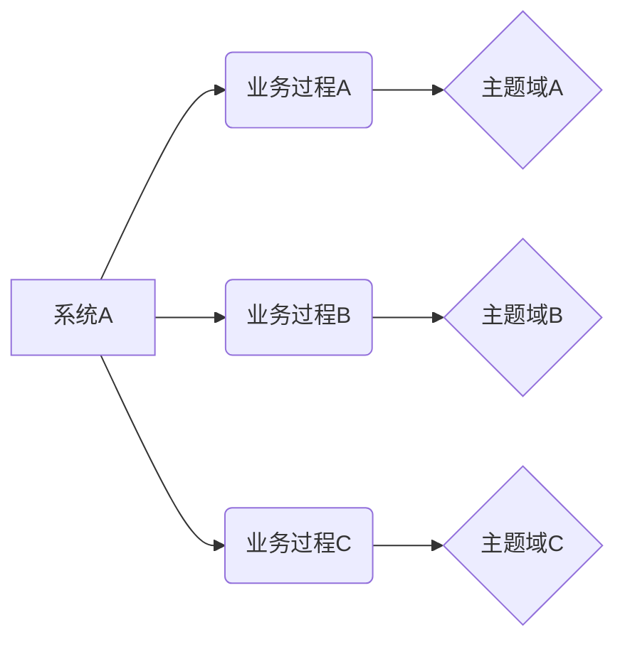

# 大数据基本理论

!!! abstract ""
    **大数据时代，基于数据仓库的治理方法论和相关的技术栈变得尤为重要。**

## 大数据概念[^1]

### 定义
数据量特别大、数据类别特别复杂的数据集，无法用传统的数据库进行存储，管理和处理。

### 特点

**4V**

- 数据量大（Volume）：PB级别
- 类别复杂（Variety）：结构化（数字、符号等），非结构化（文本、图像、声音等）
- 处理速度快（Velocity）
- 真实性高（Veracity）

且价值密度很低，质量差别大，可以产生价值。

### 示例[^2]

超市：通过进销存数据+客户购物数据+社交网络舆情监测数据，预测接下来几天的销售预期，进而制定合适的营销策略增加销售。从而产生价值。

### 作用

提炼出有用的数据。

### 总体架构

1. 数据存储：解决类型复杂和数据量庞大的问题。
2. 数据处理：快速和时效性。
3. **数据分析**：价值筛选。

**流程**：保存于存储层，根据需求目标建立数据模型和分析指标，通过处理层的强大并行和分布式计算实现价值的生成。

### 大数据分析

1. 可视化。
2. 数据挖掘：用算法提炼有价值信息。
3. 预测：建立模型，预测趋势。
4. 语义引擎：机器学习的成果，自主迭代，理解数据的含义。
5. 质量管理：剔除错误数据。

**流程**

1. 获取数据。
2. 准备数据：数据探索、预处理。
3. 分析数据：建立模型。
4. 展示结果：可视化数据结论。
5. 应用结论。

### 技术基础

**方向**

1. 集中式
2. 分布式（前沿）

**分布式文件系统优势**

1. 可扩展
2. 容错
3. 高并发：并行处理

**突破**：Google 分布式计算模型

- MapReduce：计算框架
- GFS（Google File System）：文件系统
- BigTable：数据存储系统

**主流**

1. **Hadoop**：开源，标准
    MapReduce分布式计算框架；
    基于GFS的**HDFS**分布式文件系统；
    基于BigTable的**HBase**数据存储系统。
2. Spark：基于Hadoop的改良
    存储数据由硬盘改为内存，提高速度，短期处理。
3. Storm：Twitter主推
    支持实时运算，不收集、存储数据，实时接收并处理、返回。

**使用场景**

1. Hadoop：离线、复杂
2. Spark：离线、快速
3. Storm：在线、实时

### 云计算

降低大数据处理成本，提供基础。

### 数据科学

如何利用大数据产生价值。

**5P**

- 目标：解决实际问题
- 人物：数据科学家
- 过程：团队沟通、技术工作
- 平台：计算、存储
- 可编程：R, Patterns 等

#### Web应用

应用层：仍保持传统Web应用（LAMP、JavaEE、NODE等）。
数据存储：对日志等非结构数据使用分布式文件系统。

## 数据治理[^3]

数据治理的最终目标是提升数据的价值。

### 数据

指标 = 数字 + 解释

### 治理

管理共同事务的方法综合，实现利益调和与联合行动的过程。

**基本职能**

- 计划：决策与机制建构。
- 组织：分配任务。
- 领导：激励、沟通、解决。
- 控制：监督、目标导向。

### 流程

1. 采集 存储
2. 标准化 建模
3. 清洗 质量控制
4. 分析 交付需求 服务

**示例**

- 网易数据中台产品（网易数帆链接）
- 华为数据治理产品（数据湖治理）

### 工具

▲ 数据治理的工具结构

**基础支撑**：同步和存储

1. 容器：提供治理动作的空间。
2. 管道：提供数据传输的通道。

**核心能力**：标准化管理、建模开发、共享、安全。

**应用**：展示（可视化）、算法（预测）。

## 数据仓库[^4]

### 诞生

1. 历史积存：使用频率低，堆积导致查询性能下降。
2. 企业分析：各部门数据抽取系统独立，数据不一致，资源浪费，权限存在风险。

### 概念

- Data Warehouse
- 目的：企业分析性报告和决策支持。
- 能力：业务数据筛选整合，BI（商业智能），支持到前端的可视化分析。
- 输入：各类数据源。
- 输出应用：分析、挖掘、报表。

### 特征

1. 主题：数据库对应项目，数据仓库基于实际需求，高度抽象整合，围绕主题组织。
2. 集成：多个数据源的集成，存储方式各不相同，带有抽取、清洗、转换的过程。
3. 稳定：保存历史快照，不允许修改，大多仅查询分析。
4. 时变：定期接收新集成数据。以时间戳标记版本标记最新数据，老旧可定期删除。

### 结构

▲ 数据仓库的分层架构

ODS $\rightarrow$ DW $\rightarrow$ DA

- 源数据：短周期、操作性，历史数据只读。
- 仓库：归宿，长期保存。
- 应用：从仓库独立出来面向主体需求所计算生成。

### 与数据库

- 数据库：面向交易，操作型，OLTP（On-Line Transaction Processing）。
- 数仓：历史数据分析，管理决策， OLAP（On-Line Analytical Processing）。

**区别**

1. /业务
2. 存储历史/业务实时数据
3. 引入冗余，多维度/避免冗余，易用

|     |数据仓库 | 数据库 |
|-----| ------ | ------ | 
| 面向 | 主题   | 业务 | 
| 存储 | 历史   | 业务 | 
| 类型 | 清洗过、综合 | 细节 |
| 冗余 | 有意引入，多维度指标分析 | 避免，易操作 | 
| 设计 | 分析   | 捕获并调用 | 

**例子**：银行数据库作为事务系统记账，数据仓库作为决策的平台分析数据。

## 技术栈[^5]

▲ 大数据技术栈

### 采集与预处理

- Flume NG：实时日志收集系统。
- Logstash：开源服务器端数据处理管道。
- Sqoop：将数据在关系型数据库和Hadoop之间转移。
- 流式计算：对高吞吐量数据源的实时清洗、聚合与分析。
  Strom：单主节点（nimbus）和多工作节点（supervisor）组成的主从结构
  Spark Streaming
- Kafka：分布式的、基于发布/订阅的消息系统。
- Zookeeper：分布式的、开源的分布式应用程序协调服务，提供数据同步服务。

### 分布式存储

- HDFS，HBase
- Redis：速度非常快的非关系数据库。

### 数据清洗

- MapReduce：查询引擎，大规模数据集的并行计算。

### 查询与分析

- Hive：客户端工具，把SQL语句翻译成MapReduce程序，结构化数据映射为数据库表，且有HQL查询功能，依赖HDFS和MapReduce。解决传统关系型数据库(MySql、Oracle)在大数据处理上的瓶颈。
- Impala：Hive的补充，高效SQL查询。

### 可视化

**BI**平台
- PowerBI
- FineBI
- Tableau
- Oracle

### 全貌

- 采集和预处理
- 数据存储
- 数据库操作
- 数据仓库
- 机器学习
- 并行计算
- 可视化

[^1]: 大数据基础 @知乎用户MuDbXQ https://zhuanlan.zhihu.com/p/84554633
[^2]: 大数据(big data)：基础概念 @刘博 https://zhuanlan.zhihu.com/p/33619503
[^3]: 一文给小白讲清数据治理 @POINT小数点数据 https://zhuanlan.zhihu.com/p/388520475
[^4]: 什么是数据仓库？它和数据库的区别是什么？看这一篇就够了 @麦聪软件首席架构 https://zhuanlan.zhihu.com/p/433495465
[^5]: 【基础】大数据技术栈介绍 @法映 https://zhuanlan.zhihu.com/p/138352849

## 数据分析理论（业务层）

1. 观测
- 获得数据：测量、爬取、现实场景的抽象与量化。
- 制作报表、图表。
2. 实验
- 提出假设或模型，并验证，解决实际问题。
- 例如A/B测试。
3. 应用
- 创造商业价值。

### 采集

1. 系统日志：埋点获取新数据。
2. 传感器。
3. 主动爬取和检索收集。
4. API获取对象提供的数据。

### 存储

**数据库**种类

- HiveSQL
- MySQL
- SQLserver

### 测量

**场景**

1. 日常维护：发现异常。
2. 研究数据关系。

**流程**

1. 设定标准：判断数据正常与否。
2. 寻找原因。
3. 计算推导相关性。

### 实验

即用数据分析来检验某种假设或求解某个状态或预测指标。

严谨性：重复实验和控制变量。

### 业务应用

1. 明确目标，拆解指标
  - 法则：MECE（Mutually Exclusive Collectively Exhaustive）即无重复无遗漏
  - 方法：
    - 流程拆解：按照时间流程顺序，如用户购买商品的全流程，漏斗分析法。
    - 二分拆解：变量属性分两类，如白天/黑夜。
    - 象限拆解：横纵坐标二维拆解。
    - 杜邦分析：ROE（净资产收益率）=销售净利率*资产周转率*权益乘数。
  - 模型：
    - AARRR（Acquisition、Activation、Retention、Revenue、Refer）用户增长（获取、激活、存留、收益、推荐传播）。
    - PEST：政治（Politics）、经济（Economic）、社会（Society）、技术（Technology）。
    - RFM：根据客户活跃程度和交易金额贡献，进行客户价值细分。（近度-交易间隔，频度-交易次数，额度-金额）。
    - SWOT：企业优势（strength）、劣势（weakness）、机会（opportunity）和威胁（threats）。
    - 5W1H：Who确定主题，Where进行数据集成，When时间段，What分析方法，Why原因，How (如何呈现结果）
2. 准备相关数据：数据库取数，BI搭建看板。
3. 观测：发现问题；实验：验证假设。
4. 制定策略，迭代。

自动化：使用算法针对业务目标自动监测和优化。

## 数据预处理

### 缺失值[^6]

1. 直接删除指标：若缺失太多，直接删除指标，该变量作废；如果本身数据源数量很大，或缺失较少，且剔除缺失指标后，剩余数据的其他变量指标仍然在问题域内有效，也可保留该变量。
2. 替换类似值
  - 定量数据，均值
  - 定性数据，众数（出现次数最多的值）

3. 插值
  - Newton 插值法：但注意存在Runge现象，边缘存在震荡偏差。
  - 样条插值：分段光滑曲线逼近，可保持节点光滑，规避突变。

[^6]: 缺失值的处理（数学建模-数据预处理） @数学建模BOOM https://zhuanlan.zhihu.com/p/402497542

## Excel

### 常见问题

1. 单元格右上角红色三角形：链接到注释。
2. 冻结窗格：锁定行列，滚动页面时一直可见。

### 函数[^7]

[^7]: Excel函数公式大全(图文详解) @真假斗士 https://zhuanlan.zhihu.com/p/436372294

#### 计数

- COUNT
- COUNTA（包含逻辑值等）
- COUNTBLANK
- COUNTIF
- COUNTIFS

#### 索引匹配

- LOOKUP
- VLOOKUP

#### 数学和金融函数

- SQRT
- DEGREE
- RAND()
- GCD

#### 逻辑函数

- IF
- AND
- FALSE
- TRUE

#### 日期和时间函数

- NOW()
- DATEVALUE()
- WEEKDAY(NOW())

#### 替换

- `SUBSTITUTE(text, oldText, newText, [instanceNumber])`

- `REPLACE(oldText, startNumber, NumberCharacters, newText)`

### 数据透视表[^8]

[^8]: Excel基础操作 @戴师兄 https://yrzu9y4st8.feishu.cn/mindnotes/bmncnOxqQPowAqr0iPzUZYFTirg

## 可视化：Tableau[^9]

### 常见问题[^10]

[^9]: Tableau数据可视化与仪表盘搭建 @戴师兄 https://yrzu9y4st8.feishu.cn/mindnotes/bmncnQCbk8yr68s4eBikgB06Awd
[^10]: Tableau常见面试题和答案合集：求职面试必备 https://www.lsbin.com/15371.html

## 数仓建设规范[^13]

[^13]: 最强最全面的数仓建设规范指南 @五分钟学大数据 https://yuanmore.blog.csdn.net/article/details/121265222

### 架构原则

#### 数仓分层

1. ODS 源
2. DW 明细 建模
  - DWD (Detail) 清理 规范化
  - DWM (Middle) 聚合 中间表
  - DWS (Service) 汇总 主题域服务数据 宽表（字段多）
3. DM 轻汇总
4. APP 应用
  - 数据产品 数据分析 报表
5. 维表层
  - 高基数：资料表 数据量大
  - 低基数：配置表

#### 主题域划分

- 数据域：面向业务分析，将业务过程或维度进行抽象的集合。
  - 业务过程：不可拆分的行为事件，可以定义指标，如买家下单事件
  - 维度：度量环境，如买家是维度
  为保障整个体系的生命力，数据域是需要抽象提炼，并且长期维护和更新的，但不轻易变动。在划分数据域时，既能涵盖当前所有的业务需求，又能在新业务进入时无影响地被包含进已有的数据域中和扩展新的数据域。

#### 数据模型设计

普通全量表[^4]

[^4]: 生命周期管理矩阵 https://img-blog.csdnimg.cn/img_convert/d07f7d6509938865ac596bfcfcbee826.png

### 模型

1. 星型模型：事实表+维度表

### 数据倾斜

大量的数据集中到了一台或者几台机器上计算。

表现

- MapReduce：ruduce阶段卡在99.99%
- Spark：个别task执行极慢

分类

- 频率倾斜：某区域数据量过多
- 大小倾斜：部分记录大小过大

## Hadoop

## 实例：尚硅谷-电商数仓[^11][^12]

[^11]: https://www.bilibili.com/video/BV1yY411b72x/?vd_source=e81e93bc6892fd0d7e19b265d26a2b3a

[^12]: 尚硅谷物流数仓笔记（数仓基础知识） @橘生淮南 https://zhuanlan.zhihu.com/p/647035072